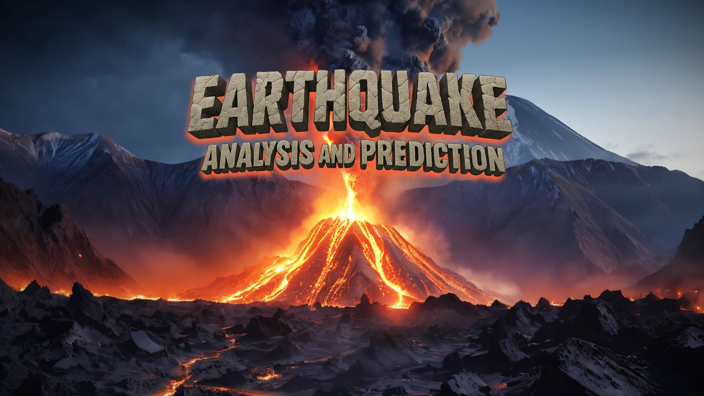
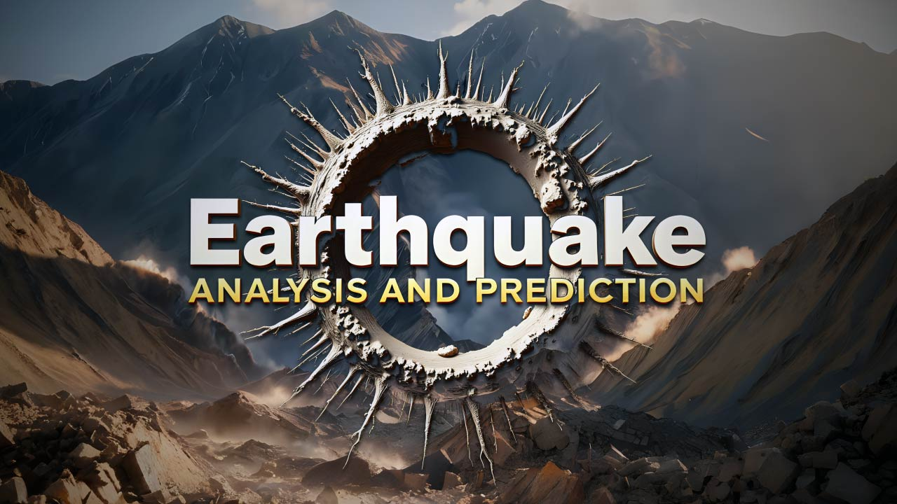

<div align="center">
  
</div>

# 🌍 **Earthquake Analysis and Prediction** 🌋

---

## 📖 **Overview**

*Welcome to* **earthquake-analysis**, *a project dedicated to* **analyzing and predicting earthquakes** *through advanced* ***data science*** *and* ***artificial intelligence*** *techniques*.  
Our goal is to **explore seismic data**, perform **deep analysis** and build **predictive models** to anticipate the occurrence and magnitude of future earthquakes.

---

## ✨ **Key Features**

- 🧹 **Cleaning and preprocessing** of historical seismic data.
- 📊 **Exploratory data analysis** (EDA) with interactive visualizations.
- 🤖 **Machine learning models** for earthquake prediction.
- 🏆 **Rigorous evaluation** of model performance.
- 📓 **Documented notebooks** and reproducible scripts.
- 📈 **Graphics and visualizations** to facilitate interpretation.
- 🖥️ **Interactive Streamlit application** for real-time data exploration.

---

## 🗂️ **Repository Structure**

```
earthquake-analysis/
├── data/                # 📁 Seismic datasets
├── notebooks/           # 📒 Jupyter Notebooks with analysis and models
├── src/                 # 🛠️ Project source code
├── streamlit_app/       # 🖥️ Streamlit application files
├── requirements.txt     # 📦 Project dependencies
└── README.md            # 📝 Main documentation
```

---

## 🚀 **Quick Installation**

1. **Clone the repository:**
    ```bash
    git clone https://github.com/your-username/earthquake-analysis.git
    cd earthquake-analysis
    ```
2. **Install dependencies:**
    ```bash
    pip install -r requirements.txt
    ```

---

## 🛠️ **How to use this project?**

1. **Add seismic data** to the `data/` folder.
2. **Run the notebooks** in `notebooks/` to explore analyses and models.
3. **Customize or extend** the scripts in `src/` according to your needs.
4. **Launch the Streamlit app** to interact with the data:
    ```bash
    cd streamlit_app
    streamlit run app.py
    ```
5. **Visualize results** and adjust models to improve prediction.

---

## 💻 **Streamlit Application**

Our interactive Streamlit application allows you to:
- Explore seismic data through dynamic visualizations
- Filter earthquakes by magnitude, region, and time period
- View predictive models' results in real-time
- Download analysis reports and findings

<div align="center">
  
</div>

---

## 🤝 **Contributions**

Contributions are **welcome**!  
If you have ideas, improvements, or find errors, open an **issue** or submit a **pull request**.  
Check the [Contribution Guide](CONTRIBUTING.md) for more details.

---

## 📄 **License**

This project is under the **MIT** license.  
See the [LICENSE](LICENSE) file for more information.

---

> _"The best way to predict the future is to create it."_  
> **— Peter Drucker**